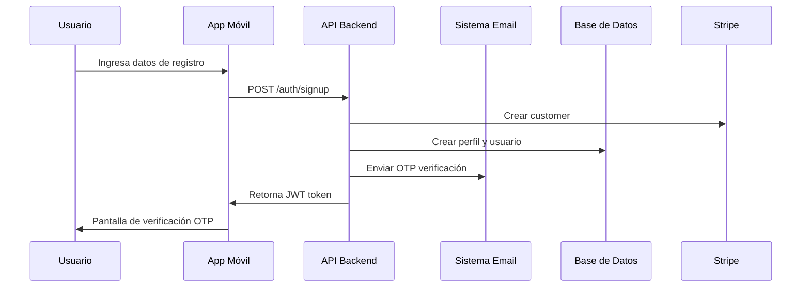
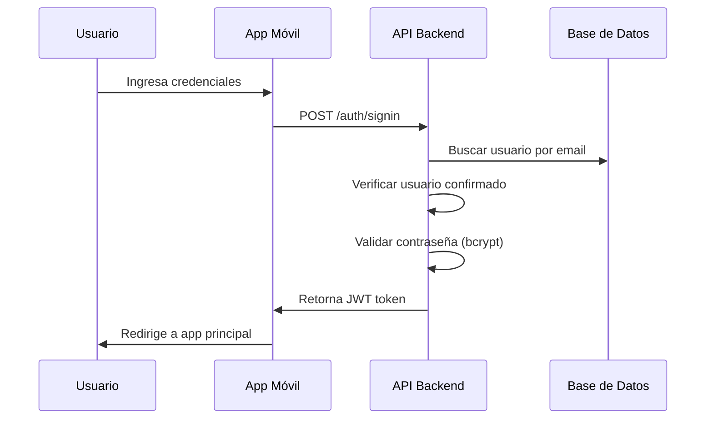
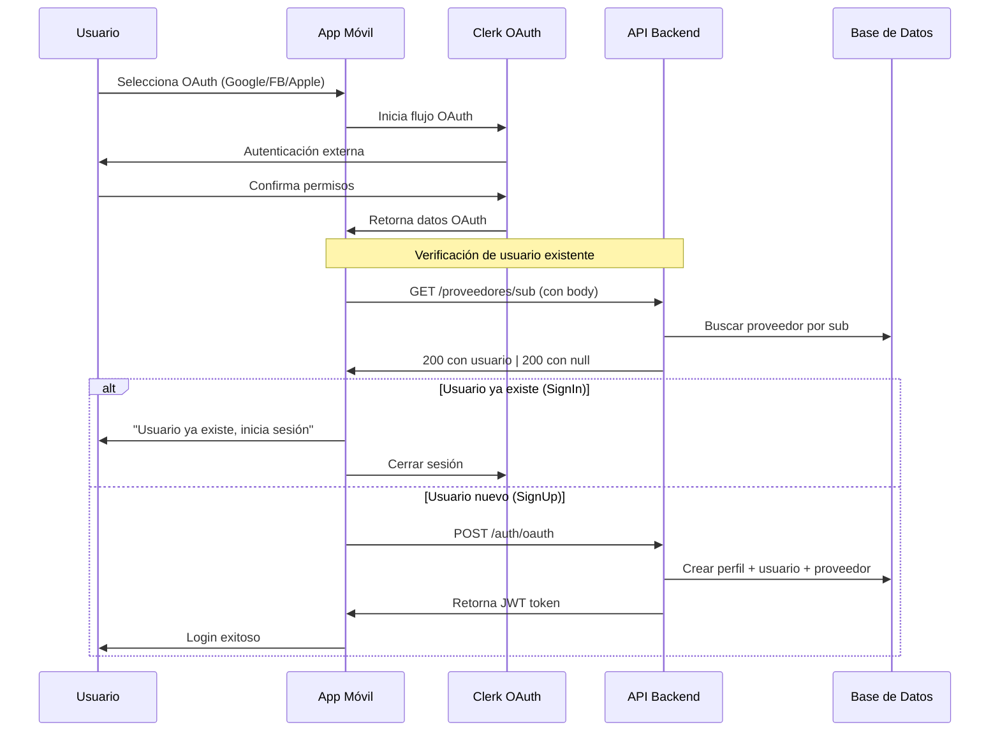
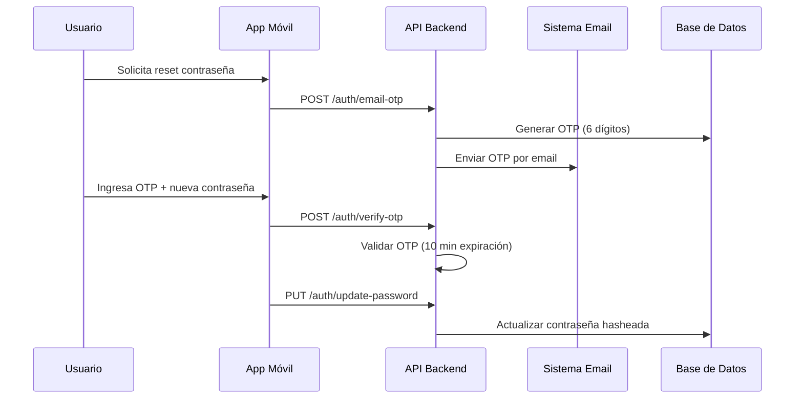

# Sistema de Autenticación - Correos México

## 🏗️ Arquitectura General

El sistema de autenticación está construido con:
- **Backend**: NestJS con TypeORM, JWT, bcryptjs
- **Frontend**: React Native con Expo y Clerk (OAuth)
- **Base de Datos**: Relacional con entidades User, Profile y Proveedor
- **Autenticación**: JWT tokens + OAuth (Google, Facebook, Apple)
- **Email**: Sistema de verificación por OTP

## 📍 Endpoints de la API

Base URL: `${process.env.EXPO_PUBLIC_API_URL}/api`

### Autenticación Básica
| Método | Endpoint | Descripción | Body |
|--------|----------|-------------|------|
| POST | `/auth/signup` | Registro de usuario | `CreateUserDto` |
| POST | `/auth/signin` | Inicio de sesión | `AuthDto` |
| GET | `/auth/me` | Obtener perfil usuario (protegido) | - |

### OAuth
| Método | Endpoint | Descripción | Body |
|--------|----------|-------------|------|
| POST | `/auth/oauth` | Autenticación OAuth | `OAuthDto` |
| GET | `/proveedores/sub` | Verificar usuario OAuth existente | `{ sub: string }` |

### Recuperación de Contraseña
| Método | Endpoint | Descripción | Body |
|--------|----------|-------------|------|
| POST | `/auth/email-otp` | Enviar código OTP | `EmailOtpDto` |
| POST | `/auth/verify-otp` | Verificar código OTP | `VerifyOtpDto` |
| PUT | `/auth/update-password` | Actualizar contraseña | `UpdatePasswordDto` |

## 🔄 Flujos de Autenticación

### 1. Registro de Usuario (Signup)


**Campos requeridos:**
- `correo` (email válido)
- `contrasena` (string)
- `nombre` (opcional)
- `apellido` (opcional)

**Proceso:**
1. Validación de datos
2. Verificación de email único
3. Hash de contraseña (bcrypt)
4. Creación de customer en Stripe
5. Creación de perfil y usuario
6. Generación de OTP (6 dígitos)
7. Envío de email de confirmación
8. Retorno de JWT token

### 2. Inicio de Sesión (Signin)


**Campos requeridos:**
- `correo` (email)
- `contrasena` (string)

**Validaciones:**
- Usuario existe
- Usuario verificado (`confirmado: true`)
- Perfil vinculado
- Contraseña válida

**Códigos de error:**
- `401`: Credenciales inválidas
- `401`: Usuario no verificado
- `500`: Perfil no vinculado

### 3. Autenticación OAuth


**Campos OAuth:**
- `proveedor` (google/facebook/apple)
- `sub` (ID único del proveedor)
- `correo` (email del proveedor)
- `nombre` (nombre del usuario)

**Flujo de Verificación:**
1. **SignIn**: Si usuario existe → error "ya existe"
2. **SignUp**: Si usuario NO existe → continuar registro
3. Usuario OAuth siempre está `confirmado: true`
4. Retorna JWT token

### 4. Recuperación de Contraseña


## 📱 Pantallas del Frontend

### SignIn (`/screens/auth/signIn.tsx`)
- **Funcionalidad**: Login con email/contraseña + OAuth
- **Validaciones**: Email formato + contraseña requerida
- **OAuth**: Google, Facebook, Apple (Clerk)
- **Navegación**: PswdReset, SignUp

### SignUp (`/screens/auth/signUp.tsx`)
- **Funcionalidad**: Registro + verificación OTP
- **Validaciones**: 
  - Email válido
  - Contraseña fuerte (8+ chars, mayúscula, número)
  - Confirmación de contraseña
- **Estados**: Registro → Verificación OTP → Login automático

### PswdReset (`/screens/auth/pswdReset.tsx`)
- **Funcionalidad**: Reset contraseña por OTP
- **Flujo**: Email → OTP → Nueva contraseña
- **Validaciones**: Contraseña fuerte con indicadores visuales

## 🔐 Seguridad y JWT

### JWT Token Structure
```json
{
  "profileId": "uuid",
  "rol": "usuario|admin|vendedor|repartidor"
}
```

### Protección de Rutas

#### JWT Authentication Guard
- **Guard**: `JwtAuthGuard` (Passport JWT)
- **Uso**: `@UseGuards(JwtAuthGuard)` en endpoints protegidos
- **Header**: `Authorization: Bearer <token>`

#### Roles Guard
- **Archivo**: `auth/guards/roles.guard.ts`
- **Funcionalidad**: Validación de roles específicos
- **Uso**: `@UseGuards(RolesGuard)` + `@Roles('admin', 'vendedor')`

```typescript
// Ejemplo de uso en controller
@UseGuards(RolesGuard)
@Roles('admin', 'vendedor')
@Get('protected-endpoint')
getProtectedData() {
  return 'Solo admin y vendedor pueden ver esto';
}
```

#### Decorador de Roles
- **Archivo**: `auth/decorators/roles.decorator.ts`
- **Funcionalidad**: Define qué roles pueden acceder al endpoint
- **Sintaxis**: `@Roles(...roles: string[])`

**Roles disponibles:**
- `usuario` - Usuario estándar
- `admin` - Administrador del sistema
- `vendedor` - Vendedor con permisos especiales
- `repartidor` - Repartidor/conductor

### Hashing de Contraseñas
- **Algoritmo**: bcrypt con salt rounds = 10
- **Validación**: `bcrypt.compare()` en login

## 🧹 Limpieza Automática

### Tokens Expirados
- **Cron**: Cada 5 minutos
- **Función**: `handleCleanExpiredTokens()`
- **Acción**: Limpia OTPs expirados (>10 min)

### Usuarios No Verificados
- **Cron**: Cada hora (comentado - activar en producción)
- **Función**: `handleCleanUnverifiedUsers()`
- **Acción**: Elimina usuarios sin verificar (>24h) + perfiles + proveedores

## 🗃️ DTOs y Validaciones

### CreateUserDto (Registro)
```typescript
{
  correo: string;     // @IsEmail
  contrasena: string; // @IsNotEmpty
  nombre?: string;    // @IsOptional
  apellido?: string;  // @IsOptional
}
```

### AuthDto (Login)
```typescript
{
  correo: string;     // @IsEmail
  contrasena: string; // @IsNotEmpty
}
```

### OAuthDto
```typescript
{
  proveedor: string;  // @IsString
  sub: string;        // @IsString
  correo: string;     // @IsEmail
  nombre: string;     // @IsString
}
```

### Password Reset DTOs
```typescript
// EmailOtpDto
{
  correo: string;     // @IsEmail @IsNotEmpty
}

// VerifyOtpDto  
{
  correo: string;     // @IsEmail @IsNotEmpty
  token: string;      // @IsNotEmpty
}

// UpdatePasswordDto
{
  correo: string;     // @IsEmail @IsNotEmpty
  contrasena: string; // @IsNotEmpty
}
```

## ⚙️ Configuración

### Variables de Entorno Backend
```env
JWT_SECRET=your_jwt_secret
STRIPE_SECRET_KEY=sk_test_...
DATABASE_URL=postgresql://...
EMAIL_SERVICE_CONFIG=...
```

### Variables de Entorno Frontend
```env
EXPO_PUBLIC_API_URL=http://localhost:3000
EXPO_PUBLIC_CLERK_PUBLISHABLE_KEY=pk_test_...
```

### Dependencias Principales

**Backend:**
- `@nestjs/jwt` - Manejo de JWT tokens
- `@nestjs/passport` - Estrategias de autenticación
- `passport-jwt` - Estrategia JWT para Passport
- `bcryptjs` - Hashing de contraseñas
- `@nestjs/schedule` - Tareas programadas (cron)
- `@nestjs/common` - Guards y decoradores
- `jsonwebtoken` - Verificación manual de JWT en RolesGuard

**Frontend:**
- `@clerk/clerk-expo` - OAuth con Clerk
- `expo-auth-session` - Sesiones de autenticación
- `@react-native-async-storage/async-storage` - Almacenamiento local

## 🚨 Manejo de Errores

### Backend Exceptions
- `UnauthorizedException`: Credenciales inválidas, usuario no verificado, token inválido
- `ForbiddenException`: Usuario sin permisos para el rol requerido
- `InternalServerErrorException`: Perfil no vinculado

### Guards Error Handling
- **RolesGuard**: Valida token JWT y roles específicos
- **Sin token**: `UnauthorizedException('Token no proporcionado')`
- **Token inválido**: `UnauthorizedException('Token inválido')`
- **Sin permisos**: `ForbiddenException('No tienes permisos')`

### Frontend Error Handling
- **Conexión**: Alert genérico en catch
- **401 específicos**: Alerts personalizados por tipo de error
- **403 Forbidden**: Redirección o mensaje de permisos insuficientes
- **Validaciones**: Estados locales + indicadores visuales

## 🔄 Estados de Usuario

1. **Registrado no verificado**: `confirmado: false` + token OTP
2. **Verificado**: `confirmado: true` + token: null
3. **OAuth**: `confirmado: true` desde creación
4. **Reset password**: Token temporal por 10 minutos

## 📋 Checklist de Implementación

- ✅ Registro con verificación email
- ✅ Login con credenciales
- ✅ OAuth (Google, Facebook, Apple)
- ✅ Reset contraseña con OTP
- ✅ JWT para autenticación
- ✅ Validaciones frontend/backend
- ✅ Limpieza automática tokens/usuarios
- ✅ Integración con Stripe
- ✅ Manejo de errores personalizado
- ✅ Guards para rutas protegidas (JWT + Roles)
- ✅ Sistema de roles y permisos
- ✅ Decoradores personalizados para autorización